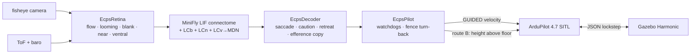
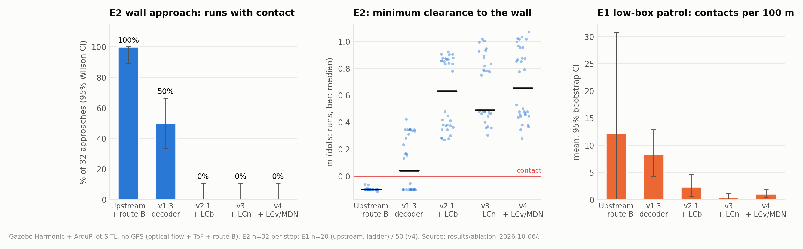
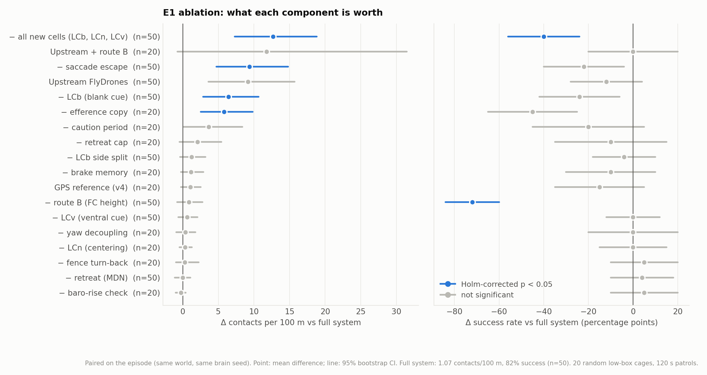

# ecps295: digital twin of the ECPS 295 course drone

Simulation work for UCI ECPS 295 (Fall 2026), following the course's phase-1 simulation route.
Nothing under `src/flydrones/` is modified; everything here subclasses or drives upstream code.

> **Reports · 实验报告 →** [`reports/`](reports/README.md) (English + 中文, with figures) ·
> S8 ablation full report: [`results/ablation_2026-10-06/REPORT_zh.md`](results/ablation_2026-10-06/REPORT_zh.md) ·
> CMA-ES / RL: [`rl/README.md`](rl/README.md)

## At a glance · 概览

A FlyDrones MiniFly connectome brain flies the 295 g / 2S course quadrotor through ArduPilot, in a Gazebo twin of the
final hardware: fisheye camera, 3901-L0X optical flow + ToF, **no GPS**.
FlyDrones 的 MiniFly 连接组大脑通过 ArduPilot 驾驶 295 g / 2S 课程四旋翼，运行在最终硬件的 Gazebo 孪生中
（鱼眼相机、3901-L0X 光流 + ToF、**无 GPS**）。

| | Upstream FlyDrones | This branch (v4 + route B) | Evidence |
|---|---|---|---|
| Wall approaches with contact · 撞墙比例 | 100 % | **0 %** | S8 E2, 32 approaches |
| Contacts per 100 m, low-box patrol · 每 100 m 撞击 | 10.2 (parks at the fence) | **1.07** | S8 E1, 50 worlds |
| Mission success without GPS · 无 GPS 成功率 | 70 % (26 % FC landings) | **82 %** (0 % FC landings) | S8 E1 |
| Companion hangs → safe landing · 机载卡死后安全降落 | – | **10/10** | S8 E3 |
| Closed-loop flights behind these numbers · 闭环飞行次数 | | **1,260** (RTF ≥ 0.95) | `results/ablation_2026-10-06/` |







| Stage · 阶段 | What · 内容 | Report |
|---|---|---|
| S4–S5, G1–G4 | SITL + Gazebo twin (airframe, fisheye, cages), MiniFly flies by camera · 孪生与闭环 | [1](reports/01_twin_and_minifly.en.md) · [中](reports/01_twin_and_minifly.zh.md) |
| S2 | custom MiniFly v1 → v4 (saccade, LCb, LCn, LCv/MDN) · 定制 MiniFly | [1](reports/01_twin_and_minifly.en.md) · [中](reports/01_twin_and_minifly.zh.md) |
| S7d / S7e / S7b | optical-flow navigation, route B, companion faults · 光流导航、路线 B、机载故障 | [2](reports/02_gps_free_navigation.en.md) · [中](reports/02_gps_free_navigation.zh.md) |
| S8 | ablation, 1,260 flights · 消融 | [3](reports/03_s8_ablation.en.md) · [中](reports/03_s8_ablation.zh.md) |
| RL | CMA-ES decoder, control arms, Gazebo multi-instance · CMA-ES 与对照臂 | [4](reports/04_cmaes_optimisation.en.md) · [中](reports/04_cmaes_optimisation.zh.md) |

The sections below are the lab notebook: setup, commands and raw tables in the order the work was done.
以下各节是实验记录：按时间顺序记录的环境、命令和原始表格。

## Layers

| Layer | What | Files |
|---|---|---|
| L1 | FlyDrones `SimDrone` with SITL-identified per-axis lag (xy 0.60 s, z 0.35 s, yaw 0.12 s) | `envs.py` |
| L2 | ArduPilot SITL Copter-4.7.0 + course params + 295 g / 2S frame model | `make_sitl_params.py`, `sitl/` |
| L2 link | `MavlinkDrone` with fixes F1 (stream requests), F3, F4 (checked takeoff), F7, F9 (heartbeat) | `mavlink_twin.py` |

## Setup

```bash
# ArduPilot (no sudo needed if gcc/g++ are present)
git clone --branch Copter-4.7.0 --recurse-submodules --shallow-submodules --depth 1 https://github.com/ArduPilot/ardupilot.git
conda create -n ardupilot python=3.11 && conda activate ardupilot
pip install "empy==3.3.4" future pexpect pymavlink MAVProxy dronecan lxml numpy pyserial setuptools
cd ardupilot && git apply ../FlyDrones/ecps295/sitl/ardupilot_sitl.patch   # JSON rng_1 + flow over obstacles, see NAV=flow
./waf configure --board sitl && ./waf copter

# FlyDrones
conda create -n flydrones python=3.11 && conda activate flydrones
pip install -e ".[vision,gestures,mavlink,dev,data]"

# SITL base params from the course .param file
python ecps295/make_sitl_params.py path/to/Params08Aug2026_CRSF.param
```

`scripts/run_sitl.sh` and `scripts/exp.sh` assume `~/sim/ardupilot`, `~/sim/FlyDrones` and `~/sim/runs`; copy them to `~/sim/`.
SITL 4.7 only loads `--model quad:<file>.json` relative to the working directory, so `run_sitl.sh` copies the JSON into the run dir.

## Gazebo Harmonic (S12)

Gazebo Harmonic 8.15 from the OSRF apt repo plus `ArduPilot/ardupilot_gazebo` built in `~/sim/ardupilot_gazebo`
(outside conda). `scripts/verify_gz.sh` runs `iris_runway.sdf` headless on the GPU, connects SITL over JSON,
and flies GUIDED takeoff to 5 m / hover / land (2026-10-03: hover SD 5 mm, RTF 1.00).

## Experiments

```bash
P=~/sim/FlyDrones/ecps295; M=quad:$P/sitl/ecps295.json
# S4 hover + learned MOT_THST_HOVER
MODEL=$M bash ~/sim/smoke.sh twin 60 $P/sitl/course_base.parm
# S4 time constants (then plot_sysid.py)
MODEL=$M bash ~/sim/exp.sh sysid "$P/sysid_tau.py" $P/sitl/course_base.parm
# S5 closed loop, L1 vs L2
python $P/run_s5.py --mode l1 --out l1          # needs PYTHONPATH=$P
MODEL=$M bash ~/sim/exp.sh s5 "$P/run_s5.py --mode l2-fixed --out l2fixed" $P/sitl/course_base.parm
python $P/compare_l1_l2.py l1.csv ~/sim/runs/s5/l2fixed.csv
# S7 / S7c no-GPS (optical flow + 1.2 m rangefinder); variants in sitl/variants/, INST=n runs in parallel
MODEL=$M INST=0 bash ~/sim/exp.sh s7 "$P/s7_flow.py" $P/sitl/course_base.parm $P/sitl/fhb_delta.parm
python $P/s7_compare.py ~/sim/runs/s7
```

`sitl/fhb_delta.parm` reflects the S7c results: rangefinder as primary height (`EK3_SRC1_POSZ 2`),
altitude-only fence (circle fence blocks arming without GPS) and `FENCE_MARGIN 0.3` (soft ceiling 1.0 m, hard fence 1.3 m).

### G1: `ecps295_quad` (Gazebo airframe)

`gazebo/make_quad.py` generates `gazebo/models/ecps295_quad/` and `gazebo/worlds/ecps295_flat.sdf` (edit the generator,
not the SDF). Same structure as Iris (blade LiftDrag + ArduPilotPlugin rotor velocity loop) sized from the twin:
295 g, 0.16 m wheelbase, 4" props, rotor loop tau 16 ms. Run with `scripts/gz_exp.sh` and SITL params
`sitl/course_base.parm gazebo/gz_ecps295.parm`.

| check (2026-10-03) | SITL twin (`ecps295.json`) | Gazebo `ecps295_quad` |
|---|---|---|
| learned MOT_THST_HOVER (target 0.32) | 0.338 | 0.323 |
| hover SD at 0.6 m | 0.013 m | 0.002 m |
| tau x / z / yaw | 0.60 / 0.35 / 0.12 s | 0.53 / 0.44 / 0.11 s |
| RTF | - | 1.000 |

Known gaps: thrust is quadratic in rotor speed (real ESC/prop curve is closer to MOT_THST_EXPO 0.52),
max rotor speed 838 rad/s is the Iris value (real 4" ~2300 rad/s), no battery current model under JSON.

### G2: front camera (ELP OV7725 twin)

`make_quad.py --camera wide` (default) adds a `wideanglecamera` with an equidistant lens to `base_link`:
120 deg hfov, 640x480, 60 Hz, gaussian noise 0.007, 12 deg nose-down, 30 mm ahead of the front motors and
15 mm below the prop plane (§4.2 estimate). Topic `/ecps295/camera`. Checked 2026-10-03:

- Harmonic 8.15 / gz-rendering8 ogre2 supports wideanglecamera + equidistant; straight edges bend as expected.
- 62.7 Hz in sim time with RTF 1.000 on the RTX 3070; hover still learns MOT_THST_HOVER 0.322.
- Props: at this mount they stay out of frame; with the camera level with the motors they fill both upper corners.
- Sensors live on `base_link`: a 10 g camera link on a `fixed` joint made the vehicle hover at 15% less thrust.

Watch it on the ROG desktop: `bash ecps295/gazebo/gz_view.sh` (3D chase view + docked camera, demo flight from
`demo_flight.py`; `--no-demo` to fly yourself). Grab frames headless: `/usr/bin/python3 gazebo/gz_grab.py`.
Only one ArduPilot Gazebo instance at a time for now (plugin port 9002 is fixed).

### G4: MiniFly flies by the Gazebo camera

`gazebo/cam_bridge.py` (system python, has the gz bindings) converts `/ecps295/camera` to 192x144 grayscale and
publishes it in `/dev/shm/ecps295_cam`; `gz_camera_drone.py::GazeboCameraMavlinkDrone` serves it as `frame()`.
`scripts/gz_g4.sh <world> <tag> "<run_g4.py args>" [--gui]` starts Gazebo, the bridge, SITL and `run_g4.py`.
Results 2026-10-03 (MiniFly synthetic, default config, camtest worlds):

- bridge 62 frames/s, frame age p95 8.8 ms, brain >= 2.2x real time
- probe (open loop): yaw right/left, climb, descend all produce an opposing command (optomotor stabilisation OK);
  side effects: yawing also raises throttle (+0.2), flying forward 0.3 m/s commands descent (-0.09, same size as a
  real 0.2 m/s climb), so S8-d is a real concern
- looming needs texture: plain cardboard box peaks DNp03/DNp01 10/20 Hz (no escape); taped box 60/40 Hz,
  DNp03 >= 20 Hz at 0.74 m, escape onset only at 0.23 m (decoder GF filter)
- closed loop: hover 40 s at 0.60-0.88 m with no safety events; approach at ~0.25 m/s brakes from 0.7 m,
  escapes (climb) at ~0.1 m and clears the 0.5 m box by 0.15 m; geofence stops it at 2.16 m
- ROOM panel: `make_quad.py` writes `worlds/<world>.layout.json`; `gz_g4.sh` passes it so the obstacles are drawn

### Monitor window (`monitor.py`)

One window: MiniFly dashboard on the left, live Gazebo view on the right (keys: `c` switch camera, `q` quit).

    bash ~/sim/gz_g4.sh ecps295_camtest_tape.sdf g4_watch "--mode approach --seconds 40 --cruise 0.5 --live --out watch"

- `run_g4.py` publishes every tick on 127.0.0.1:5799 from a forked child (ticks are dropped when no monitor is
  connected); `--live` starts `monitor.py` unless it is already running. The monitor outlives runs and reconnects.
- The right panel is rendered by Gazebo: a chase camera rigid behind the drone (and optionally a fixed overview
  camera). cam_bridge.py publishes it to /dev/shm next to the drone camera.
- Each extra camera sensor costs ~4-6% RTF under lockstep, almost independent of size and rate:
  none 1.000, chase 640x360@30 0.957, chase+overview 640x360@15 0.916, both 960x540@30 0.879
  (a 512 instead of 1024 wide-angle cube map did not help). So the view cameras only exist in the
  `ecps295_quad_monitor` model and `*_monitor` worlds that gz_g4.sh picks with `--live`; plain worlds stay at 1.000.
- Monitor run 2026-10-03: control tick p50/p95/max 50.1/50.1/51.0 ms, frame age p95 8.6 ms, RTF mean 0.946
  (one 0.14 stall sample; gz_g4.sh now also reports the median).

### G4 flight-test suite (`scripts/g4_suite.sh`, 2026-10-03)

Upstream synthetic MiniFly, default config, headless plain worlds (RTF 1.000, control tick p95 50.1 ms). Tall walls
(1.5 m, above the 1.0 m ceiling) 1.7 m ahead. Clearance = prop tip to surface; negative = contact.

| test | setup | contact | brake onset | escape onset | note |
|---|---|---|---|---|---|
| T1_v015 | taped wall, 0.15 m/s | yes | 0.23 m | 0.06 m | slow approach looms late |
| T1_v025 | taped wall, 0.25 m/s | yes | 0.44 m | 0.40 m | |
| T1_v035 | taped wall, 0.35 m/s | yes | 1.01 m | 0.50 m | stops at 0.33 m after escape, then creeps in |
| T2_plain | plain wall, 0.25 m/s | yes | 0.28 m | - | never escapes |
| T3_offset | taped wall 0.45 m right | yes | 0.31 m | 0.15 m | 3 escapes, no turn-away |
| T4_freeze | taped, camera frozen at 3 s | yes | 0.02 m | - | no frame-staleness check anywhere |
| T5_hover | 90 s hover | no | - | - | 0.60-0.98 m, no safety events |

Failure mechanism (T1_v035 trace, `suite_trace.py`): looming only signals expansion. Once the drone has stopped, the
wall fills the view, nothing expands, DNp03 goes silent, the brake memory (x0.93 per tick) fades and the cruise
pushes it into the wall. Needs: brake/escape memory or a no-advance state after a scare, a near-obstacle cue that
does not depend on expansion (S2), and a camera staleness watchdog next to F2 (S6).

### G3: course cages (`ecps295_cage20.sdf`, `ecps295_cage10.sdf`)

Generated by `make_quad.py` (centred on the take-off point, drone facing north):
20' cage 6.1 x 6.1 x 3.05 m and 10' cage 3.05^3 m; 5 cm aluminium posts every <= 3.05 m with top rails; net walls as
real strands (4 mm on a 10 cm grid, with a thin collision box) so the camera sees far buildings and trees 30-60 m
outside; 24" two-tone EVA checker floor with random tape strips; 18-24" cardboard boxes (taped and plain) and in the
20' cage a 1.1 m two-box stack straight ahead (above the 1.0 m ceiling); four lab lamps. The net walls are also in the
layout, so the ROOM panel draws the cage and the clearance metric includes them.

2026-10-03, 20' cage: hover 30 s at 0.60-0.86 m with no safety events, RTF 1.000, tick p95 50.1 ms, compute p95
9.1 ms. Approach toward the stack at 0.25 m/s reproduces the wall-suite failure (escape at 0.24 m, stops, creeps in).
Still open from §6A G3: real EVA mat photo texture and light levels from a lux measurement in the cage.

## S2: custom MiniFly (2026-10-03)

Upstream code untouched. Variants are YAML files in `minifly/`; v2 adds neurons via `my_minifly.py` (upstream block
bit-identical, calibrate R^2 unchanged: throttle 0.912, yaw 0.812).

| file | role |
|---|---|
| `ecps_decoder.py` | `EcpsDecoder`: saccade escape (turn away + back-off) triggered by DNp01, DNp03 or a hard brake; caution period; slower brake memory; efference copy (throttle per forward); yaw/throttle decoupling |
| `ecps_pilot.py` | `EcpsPilot`: F2 brain-age watchdog actually wired in; camera staleness -> hover, -> land after 3 s |
| `ecps_retina.py` | `EcpsRetina`: `blank` feature, sudden loss of texture in the central field per eye |
| `my_minifly.py` | v2 connectome: 24 LCb cells per side, LCb -> PVLP (8), -> DNp01 (2), -> contralateral PVLP_inh (2) |
| `blank_eval.py` | offline check of `blank` on recorded frames |

Run: `run_g4.py --config minifly/v2.yaml --decoder ecps --pilot ecps --retina ecps`,
suite: `VARIANT=v2 DECODER=ecps PILOT=ecps RETINA=ecps bash g4_suite.sh`.

| version | change | wall-suite contacts (6 approach tests) |
|---|---|---|
| v0 | upstream | 6/6 |
| v1 | saccade escape, caution, efference copy, yaw decoupling, 60 deg/s yaw | 3/6 (slow 0.15 m/s, plain wall, frozen camera) |
| v1.1 | saccade threshold 15 Hz, caution on brake, EcpsPilot watchdogs | frozen camera fixed; 0.15 m/s still creeps in after the caution |
| v1.2 | a hard brake also triggers the saccade | 0.15 m/s fixed; offset wall regressed (decayed brake re-triggered toward the wall) |
| v1.3 | brake trigger on the current tick only, 1 s refractory, keep turn direction | taped walls and offset pass |
| v2 | + LCb frontal blanking cells | **0/6**, plus probe, 60 s hover and 20' cage pass |

v2 details: plain wall saccade at 1.36 m (min clearance 0.56 m); `blank` offline: 1.0 from 1.11 m on the plain wall,
0 on the taped wall approach and in 20' cage hover. Probe after v1: yaw->throttle coupling +0.17 -> +0.005, forward
flight false descent -0.086 -> -0.044. Open: on the offset wall v2 turns toward the side the wall extends (blank
saturates in both eyes, so the side is a coin flip) - keep the per-eye difference in the next variant.

### v2.1 turn direction and the patrol test (2026-10-03)

v2.1 (`minifly/v2_1.yaml`, `vision.ecps_blank.side_gain: 2.0`): the blank level still comes from the central band, the
side from the textureless share across each whole eye, like upstream looming's loom_by_eye. Offline (`blank_eval.py`)
on a plain wall offset 0.45 m right: right eye 1.0 / left eye 0.0 from 1.23 m; head-on plain wall still fires both
eyes from ~1.26 m; 20' cage hover stays 0.

First saccade direction on walls offset to the right, 3 brain seeds each (no contact in any of the 12 runs):
v2 plain L L L, taped R R L (4/6 correct); v2.1 plain L L L, taped R L L (5/6). Remaining wrong turn on the taped
wall: its left edge expands into the left eye, so edge-based looming reports a left threat. Candidate v3: a
centering pathway (steer away from the stronger translational flow, as bees and flies do); note that the upstream
optomotor wiring turns TOWARD the side with stronger front-to-back flow.

T7_patrol: 120 s free cruise (~0.25 m/s) in the 20' cage with `--fence-turn` (safety layer in EcpsPilot: near the
geofence and heading out, yaw back toward the centre; upstream only zeroes forward there, so the drone parks).
v2.1: 0 contact episodes, 3 near misses (< 0.1 m, min 0.037 m, all at the corner of the 1.1 m box stack during a
saccade turn in place), path 21.9 m, coverage 63.5 % of 0.5 m cells inside the fence, 5 saccades, 12.1 s of fence
turn-back. `patrol_report.py` draws the map and lists near misses.

`gz_g4.sh` now clears leftover SITL / Gazebo / bridge processes and waits for ports 5760, 9002 and 5799 before
starting, and waits for its own processes to exit afterwards: back-to-back runs sometimes found the previous SITL
still bound to 5760 and two Gazebo servers publishing the camera (97 frames/s).

### v3 centering response and patrol statistics (2026-10-03)

v3 (`my_minifly.py v3`, `minifly/v3.yaml`): 24 LCn cells per side fed by EcpsRetina `near` = asymmetry of
front-to-back flow in the lateral field (outer 3 of 8 columns per eye, rows 2-6), only while both eyes see forward
translation, the gyro is quiet (EcpsPilot passes the previous tick's yaw rate) and neither side is textureless (plain
surfaces give no flow and are left to `blank`). LCn_s -> HS_o turns away from the near side through the optomotor
premotor path (same signature as an ordinary yaw command, so the throttle decoupling holds; LCn_s -> LAL_inh_s
pulled one DNg02 down and would have sunk the drone); LCn_s -> PVLP_inh_o biases the saccade side. Upstream block
identical, calibrate R^2 unchanged. Whole-eye `near` picked up frontal edge flow (left/right noise up to 0.5), hence
the lateral field.

Turn direction, taped wall offset right, first saccade over 3 seeds: v2 R R L, v2.1 R L L, v3 L L L (min clearance
0.41-0.43 m vs 0.26-0.34 m).

120 s patrols in the 20' cage (`run_matrix.sh`, `matrix_stats.py`, `patrol_report.py`):

| variant | runs | runs with contact | near-miss episodes |
|---|---|---|---|
| v2.1 | 5 | 3 | 8 |
| v3 (fence turn-back overriding saccades) | 4 (+1 sim stall) | 0 | 5 |
| v3 (fence turn-back yields to saccades) | 5 | 3 | 5 |
| v3.1 (back-off 0.5 for 0.8 s, brake gains 0.03/0.04) | 5 | 3 | 9 |
| v3.2 (centering on the outer 5 columns) | 5 | 2 | 12 |

Every v3-family contact is a graze (<= 4 cm) at a corner of the 1.1 m box stack, which sits right at the 2 m geofence.
The fence turn-back makes the patrol settle into a diamond loop whose north-east leg passes that corner obliquely
every lap; an obstacle 30-45 deg off the heading makes lateral flow, not expansion, so DNp03 stays at 0 until about
5 cm. v2.1's extra contacts were at box_e with no escape at all; v3 removed those. Next candidate: optic-flow speed
regulation (slow down when lateral flow is high, as bees do) so looming has time to fire.

Simulation stall seen once in ~45 runs: telemetry and camera froze mid-flight (SITL/Gazebo lockstep, extra
"ArduPilot controller has reset"); EcpsPilot's camera watchdog hovered and landed as designed.

### S7d: the 3901-L0X in Gazebo (`NAV=flow`, 2026-10-03/04)

The Gazebo runs above use GPS. The real drone has no GPS: it navigates on the Matek 3901-L0X (PMW3901 optical flow +
VL53L0X ToF, both facing down). `NAV=flow bash ~/sim/gz_g4.sh ...` flies that configuration (`sitl/fhb_delta.parm`;
`EXTRA_PARM=a.parm,b.parm` stacks variants on top).

- `make_quad.py`: downward ToF on `base_link` (`gpu_lidar`, 27 deg, 5x5 beams, 2 m, 10 Hz), sent to SITL as `rng_1`.
  30 Hz cost RTF 1.000 -> 0.906 over whole runs, 10 Hz -> 0.973.
- Flow is still SITL's (`SIM_FLOW_*`). `sitl/ardupilot_sitl.patch` (apply before building SITL):
  - Copter-4.7.0's JSON backend tested the wrong received bits for `rng_1..6` (bits 7-12 instead of 10-15 after
    latitude/longitude/altitude were added to the keytable), so no Gazebo range ever reached the rangefinder.
    Fixed on master by ArduPilot#33342; backport to ArduPilot-4.7 proposed in ArduPilot#34610.
  - Over an obstacle (ToF more than 10 cm shorter than the height above the floor) SITL flow is scaled by the measured
    range, as the real sensor's would be.
- `fhb_delta.parm` fixes: `SIM_FLOW_DELAY` counts samples, not ms (10 was 500 ms at 20 Hz; the S7 "flow rate is
  highly sensitive" result was mostly this lag), now 0; `COMPASS_AUTODEC 0` + `COMPASS_DEC` (without GPS the EKF
  aligned yaw 11 deg off).
- Take-off without GPS (`mavlink_twin.py`): EKF origin, ALT_HOLD lift-off with an RC throttle override (sent as the GCS
  sysid 255, the only one ArduPilot accepts overrides from), GUIDED from 0.1 m, climb until ToF or EKF height reaches
  the target (the EKF height lagged the ToF by up to 0.8 m).
- `run_g4.py` scores clearance, path and radius on simulator truth (`SIM_STATE`); `ekf_*` columns hold the estimate.
- `gz_g4.sh` writes `RTF run X over N s` (sim vs wall clock over the flight) to `rtf.log`; the 40-sample window mean
  ranged 0.56-0.98 for the same setting and is kept only for reference.

120 s patrols in the 20' cage, v3, 5 seeds each, ToF 10 Hz, whole-run RTF 0.97 (`nav_compare.py`):

| configuration | runs with contact | near misses | path m | EKF xy error max (median / max) | runs past the 2 m fence | runs > 1.3 m | runs on the floor |
|---|---|---|---|---|---|---|---|
| GPS | 1 | 6 | 25.2 | 0.05 / 0.05 | 0 | 0 | 0 |
| flow, ToF primary height (`fhb_delta`) | 1 | 9 | 12.6 | 0.42 / 0.77 | 0 | 4 | 4 |
| flow, baro only (`variants/C_baro_only.parm`) | 0 | 2 | 18.7 | 0.67 / 4.80 | 2 | 2 | 2 |
| flow, baro + `EK3_TERR_GRAD 0.2`, `EK3_RNG_I_GATE 1000` (`variants/F_baro_terrain_steps.parm`) | 3 | 6 | 18.7 | 0.61 / 1.56 | 2 | 2 | 1 |

Flying low over the 0.46-0.6 m boxes is what breaks optical-flow navigation. The ToF range drops (0.83 -> 0.40 m) and
the EKF height is pulled down by 0.4-1.0 m: directly with the ToF as primary height, and through the flow fusion's
terrain state with baro only (baro height `CTUN.BAlt` stays right). The controller climbs, the drone crosses the
1.3 m hard fence and lands (the short ~6 m runs), or keeps flying low with the bias. The EKF terrain parameters do not
help. Without GPS the horizontal estimate also drifts enough to carry the drone past the geofence. Contacts are no
worse than with GPS. Open question: how tall the real cage obstacles are.

`logscan.py` (attitude, flow, rangefinder after arming), `flowcheck.py` (logged flow vs truth), `ctun.py` (altitude
controller) read the SITL DataFlash logs in each run dir.

### S7e: obstacles under the drone, MiniFly v4 and the companion height (route B, 2026-10-04)

S7d showed that without GPS a low box under the drone breaks the flight controller's height. S7e attacks it from both
sides, tested on five random low-box cages (`ecps295_lowbox_s0..4`: 6 boxes each, 0.2-0.75 m tall or a 1.1 m stack,
centres 1.0-2.3 m from take-off; the real cage layout is not known yet).

**Ventral cue** (`ecps_ventral.VentralCue`): surface height T = baro height - ToF range. The drone's own climb or sink
moves both terms together, so T only changes when the surface under the drone does, abrupt or gradual (a box edge
entering the 27 deg cone from the side shortens the min-of-cone range at the drone's speed, which a step test on the
range alone misses). Plus a fast path for steps of >= 0.10 m faster than 0.6 m/s. The flow EKF height is not usable:
it is what the box corrupts. Offline on the S7d DataFlash logs (`ventral_eval.py`): 90% of box crossings, median
0.2 s after entering, the remaining alarms mostly at box edges.

**MiniFly v4** (`my_minifly.py v4`, `minifly/v4.yaml`): v3 + 16 LCv cells per side (EcpsRetina `ventral`, both sides
equal: one ToF) -> 2 MDN per side ("moonwalker" descending neurons, backward walking in Drosophila). EcpsDecoder
`retreat`: MDN above 20 Hz backs the drone up along the way it came (forward -0.5, no yaw) until MDN has been quiet
for 1 s (min 1.5 s), then one saccade. A first v4 fed LCv into PVLP like LCb: the drone saccaded in place over the box
for 5 s. `ventral_probe.py` is the open-loop check.

**Route B, companion height** (`mavlink_twin.py ext_height`, `run_g4.py --ext-height`,
`sitl/variants/G_extnav_height.parm`): the companion sends its height above the FLOOR to ArduPilot as
`VISION_POSITION_ESTIMATE` z at 20 Hz (tilt-corrected ToF while nothing is under the drone, baro minus the frozen floor
baseline while something is or out of range); `EK3_SRC1_POSZ 6`, `VISO_TYPE 1`. ArduPilot falls back to baro on its
own if the messages stop for 0.5 s; x/y echo the EKF and are not fused. The EKF terrain state then sees the box as
terrain, which is what it is. An EcpsPilot `height_guard` (descend above 1.0 m by the same estimate) did not work:
ArduPilot executes velocity commands with the corrupted EKF, so it still climbed over the box and later integrated a
target that put the drone on the floor; it stays in v4.yaml, disabled.

120 s patrols, `NAV=flow`, 5 worlds per group, whole-run RTF 0.971-0.974 (`lowbox_compare.py`):

| brain | FC height | runs with contact | contacts | near misses | path m | over boxes s | max true height m | FC landings | FC height error max m (median / max) |
|---|---|---|---|---|---|---|---|---|---|
| v3 | flow EKF (ToF) | 4 | 5 | 7 | 7.9 | 9.2 | 1.47 | 4 | 1.11 / 1.22 |
| v4 | flow EKF (ToF) | 1 | 1 | 1 | 7.8 | 3.9 | 1.45 | 4 | 0.71 / 0.81 |
| v3 | companion (B) | 1 | 1 | 2 | 26.4 | 24.2 | 1.02 | 0 | 0.15 / 0.19 |
| v4 | companion (B) | 0 | 0 | 4 | 23.6 | 8.3 | 1.00 | 0 | 0.10 / 0.14 |

Route B fixes the height: no fence landings, the FC height within 0.1-0.2 m, paths back to the 20' cage level, the
drone stays at the 1.0 m soft ceiling. v4 alone halves the time over boxes and the contacts but cannot stop the FC
from climbing (4/5 landings). Together: no contacts, a third of the time over boxes. Open: companion dropout in flight
(the baro fallback), real baro noise and prop wash, the ExtNav latency on the Orange Pi.

### S7b: companion faults with route B (2026-10-04/05)

`run_g4.py` fault injection: `--ext-drop-at T [--ext-drop-for D]` stops only the companion's height messages (height
module dead, brain still flying), `--mute-at T` stops everything the companion sends (Orange Pi hung); `--freeze-cam-at`
as before. First round (v4 + B, 5 random low-box cages, fault at 30 s):

- hover, height stopped 10 s then resumed: ArduPilot fell back to baro and back to ExternalNav within 2 cm.
- height stopped for good while the brain kept patrolling: 4/5 FC landings, up to 2.17 m. On baro, a box under the
  drone pulled the EKF height from 0.87 to -0.04 m in 2 s and ArduPilot climbed at full rate.
- companion hung: GUIDED timed out after 1 s, the drone hovered steadily on baro, but until the battery runs out.
- separately, a v4 retreat ran 4 s (MDN kept firing along a box edge) and backed into an obstacle: nothing looks
  backwards.

Fixes: EcpsPilot `height_source` watchdog (no height sent for 0.5 s: hover, 3 s: land), EcpsDecoder `retreat.max_s`
2.0 (then MDN has to go quiet before the next retreat), and `sitl/variants/companion_fs.parm` (the companion's sysid
254 counts as a GCS, `FS_GCS_ENABLE 5` lands 2 s after its heartbeat stops). With and without each (E3 of the S8
ablation, 10 cages each, all runs RTF >= 0.95):

| fault at 30 s | with the fix | without |
|---|---|---|
| camera freezes | watchdog hover after 0.25 s, land after 3 s; 1/10 runs with contact (at 20 s, before the fault) | 4/10 with contact |
| height module stops | hover after 0.45 s, land after 3 s; 0/10 above 1.3 m | 7/10 above 1.3 m (max 2.61 m), 7/10 fence landings |
| height stops 10 s, then resumes | landed at 3 s by the watchdog, 0/10 above 1.3 m | - |
| companion hangs | 10/10 landed by the GCS failsafe | 10/10 hovering until the end |

### S8 ablation infrastructure (2026-10-05)

- Parallel Gazebo/SITL: `INST=n bash gz_g4.sh` (own `GZ_PARTITION`, plugin port 9002+10n via a per-run model copy,
  SITL `-I n` = TCP 5760+10n, camera shm `/dev/shm/ecps295_i<n>_cam`, cleanup by process group). On the ROG two
  instances keep RTF 0.956-0.962 (one: 0.973; three: 0.83-0.89, CPU bound: each Gazebo takes ~3 cores).
  `run_matrix_par.sh <matrix> <log> <N>` splits a matrix over N instances.
- `run_g4.py --set key.path=value` (YAML value) overrides any config entry after `--config`: one switch per ablation.
- `gen_ablation.py OUT` writes the matrices: E1 patrols on 20 random low-box cages (`lowbox_s0..19`) for 22 conditions,
  E2 wall approaches (4 walls x 8 seeds) for 15, E3 faults; `run_ablation.sh OUT 2 [batch ...]` runs them and re-runs
  every run with whole-run RTF < 0.95 on one instance. `ablation_stats.py` pairs conditions on the episode: bootstrap
  95% CIs, Wilcoxon signed-rank with rank-biserial r, exact McNemar for binary outcomes, Holm correction per metric.

### S8 ablation results (2026-10-06)

Full report (Chinese) with method, all tables and discussion: `results/ablation_2026-10-06/REPORT_zh.md`; per-run CSV,
paired statistics (`e1/e2/e3_*.md|json`), the matrices and the thermal log are next to it.

1,260 closed-loop flights, all whole-run RTF >= 0.95 (157 parallel runs below it were re-run on one instance; the
criterion was not changed). No GPS (flow + ToF + route B) unless stated. Paired on the episode, Holm-corrected.

| removed / condition | E1 contacts per 100 m (full 1.07) | E1 success (full 82%) | E2 wall contact (full 0%) | E2 min clearance m (full 0.68) |
|---|---|---|---|---|
| all new cell types (LCb, LCn, LCv), n=50 | **13.8** | **42%** | **47%** | **0.11** |
| saccade escape, n=50 | **10.5** | 60% | 0% | **0.19** |
| LCb, n=50 | **7.5** | 58% | **50%** | **0.10** |
| efference copy, n=20 | **6.2** | 45% | 0% | **0.44** |
| route B (FC height from the ToF), n=50 | 1.9 | **10%** (88% FC landings) | - | - |
| LCv / retreat, n=50 | 1.7 / 1.1 | 82% / 86% | - | - |
| upstream FlyDrones, n=50 | 10.2 (parks at the fence: 2.9 m path) | 70% (26% FC landings) | **100%** | **-0.09** |

Bold: p < 0.05. LCb and the saccade escape carry the wall avoidance; route B is what makes flying without GPS
possible. With route B working, v4's ventral pathway only shortens the time over low boxes (21.8 -> 9.4 s); it is a
behavioural layer for when the height estimate fails (S7d), not a safety gain in nominal flight. The efference copy
turned out to hold the cruise height: without it the drone flies 0.17 m lower and the low boxes become obstacles.
E3: height-source watchdog 7/10 -> 0/10 runs above the 1.3 m fence (p = 0.016), companion failsafe 0/10 -> 10/10
landed (p = 0.002), camera watchdog contacts 4/10 -> 1/10 (n.s.).
