# Report 1 — Digital twin of the ECPS 295 drone and the MiniFly v0 → v4 evolution

> Branch `ecps295-sim` · code in `ecps295/` · experiments 2026-10-01 … 10-04 on the ROG Strix G733QR
> (Ryzen 9 5900HX, RTX 3070 Laptop), Gazebo Harmonic 8.15 + ArduPilot Copter-4.7.0 SITL.
> 中文版：[01_twin_and_minifly.zh.md](01_twin_and_minifly.zh.md)

## Abstract

We built a three-layer digital twin of the 295 g / 2S course quadrotor (FlyDrones kinematic model → ArduPilot SITL →
Gazebo with a camera, optical-flow and ToF twin) and used it to make the FlyDrones *MiniFly* connectome brain fly
real closed-loop missions through ArduPilot. The upstream MiniFly hit the wall in **6/6** approach tests. Five
design iterations, each driven by one failure seen in the twin, added a saccade escape, safety watchdogs and three
new cell types (LCb blank detector, LCn centering, LCv ventral cue). v2 already reached **0/6** contacts, and the
S8 ablation (Report 3) confirms the step change: wall contact falls from 100 % (upstream) to 0 % from v2.1 on.

## 1. The twin

| Layer | Content | Check (2026-10-03) |
|---|---|---|
| L1 | FlyDrones `SimDrone` with SITL-identified per-axis lag | τ xy / z / yaw = 0.60 / 0.35 / 0.12 s |
| L2 | ArduPilot SITL Copter-4.7.0, course `.param`, 295 g frame JSON | learned `MOT_THST_HOVER` 0.338 (target 0.32) |
| G1 | Gazebo airframe `ecps295_quad` (LiftDrag blades, rotor loop τ 16 ms) | hover SD 2 mm, τ 0.53 / 0.44 / 0.11 s, RTF 1.000 |
| G2 | ELP OV7725 twin: 120° equidistant fisheye, 640×480 @ 60 Hz, 12° nose-down | 62.7 Hz sim time, props out of frame |
| G3 | 20 ft / 10 ft course cages: net strands, EVA checker floor, cardboard boxes, lamps | hover 30 s 0.60–0.86 m, compute p95 9.1 ms |
| S7d | 3901-L0X twin: down-looking ToF (27°, 5×5 beams, 10 Hz) + SITL flow scaled over obstacles | see Report 2 |

Two upstream defects were found and fixed along the way:

- **ArduPilot JSON backend** tested the wrong bits for `rng_1..6`, so no Gazebo range ever reached the rangefinder.
  Fixed on master as ArduPilot#33342; we proposed the 4.7 backport ArduPilot#34610 (`sitl/ardupilot_sitl.patch`).
- **`SIM_FLOW_DELAY` counts samples, not ms**: the course value 10 meant 500 ms of flow lag. Most of the early
  "flow rate is very sensitive" result was caused by this.

```mermaid
flowchart LR
  CAM["Gazebo fisheye<br/>/ecps295/camera"] -->|cam_bridge.py<br/>192×144 gray, /dev/shm| RET["EcpsRetina<br/>flow · looming · blank · near · ventral"]
  TOF["ToF + baro"] --> VEN["VentralCue"] --> RET
  RET --> ENC["InputEncoder<br/>Poisson rates"] --> MF["MiniFly LIF connectome<br/>(v4: +LCb +LCn +LCv → MDN)"]
  MF -->|DNg02 · DNp03 · DNp01 · MDN| DEC["EcpsDecoder<br/>saccade · caution · retreat · efference copy"]
  DEC --> PIL["EcpsPilot + SafetyGovernor<br/>camera / height watchdogs · fence turn-back"]
  PIL -->|GUIDED body-frame velocity| AP["ArduPilot SITL 4.7"]
  PIL -->|route B: VISION_POSITION_ESTIMATE z| AP
  AP <-->|JSON, lockstep| GZ["Gazebo Harmonic<br/>ecps295_quad"]
```



### 1.1 Real-time discipline

Every run is lock-stepped; a run counts only if its **whole-run real-time factor is ≥ 0.95**. Extra view cameras cost
4–6 % RTF each, so they exist only in the `*_monitor` worlds used for watching. The control tick holds 50.1 ms at p95
and a single brain tick takes ≈ 9 ms (p95) on the ROG, which is the budget we later replay for the Orange Pi.

## 2. The upstream brain in the twin (G4 suite)

Upstream synthetic MiniFly, default config, tall walls 1.7 m ahead:

| Test | Setup | Contact | Brake onset | Escape onset |
|---|---|---|---|---|
| T1 v0.15 | taped wall, 0.15 m/s | yes | 0.23 m | 0.06 m |
| T1 v0.25 | taped wall, 0.25 m/s | yes | 0.44 m | 0.40 m |
| T1 v0.35 | taped wall, 0.35 m/s | yes | 1.01 m | 0.50 m |
| T2 | plain wall | yes | 0.28 m | never |
| T3 | taped wall offset 0.45 m | yes | 0.31 m | 0.15 m |
| T4 | camera frozen at 3 s | yes | 0.02 m | never |
| T5 | 90 s hover | no | – | – |

**Failure mechanism.** Looming only signals *expansion*. Once the drone has braked, the wall fills the view, nothing
expands, DNp03 goes silent, the brake memory fades and the cruise command pushes the drone into the wall. A plain
wall produces no flow at all, and nothing in the stack noticed a frozen camera.

## 3. MiniFly v1 → v4: one failure, one fix

The upstream code was not changed; every variant subclasses it or adds neurons with `my_minifly.py` (the upstream
block stays bit-identical, calibration R² unchanged: throttle 0.912, yaw 0.812).

| Version | Change | Wall-suite contacts |
|---|---|---|
| v0 | upstream | 6/6 |
| v1 | saccade escape (turn away + back-off), caution period, efference copy, yaw decoupling | 3/6 |
| v1.1–1.3 | saccade threshold 15 Hz, brake-triggered saccade, 1 s refractory, camera/brain-age watchdogs | taped + offset pass |
| **v2** | **+ LCb blank cells** (sudden loss of central texture) → PVLP / DNp01 | **0/6** |
| v2.1 | LCb side from the whole-eye textureless share | correct turn side 5/6 |
| v3 | **+ LCn centering** (lateral front-to-back flow asymmetry → turn away) | turn side 3/3, clearance +0.1 m |
| v4 | **+ LCv → MDN** ("moonwalker") retreat from a surface rising under the drone | see Report 2 |

The effect of each step was measured again, at scale, in the S8 ablation:


*Figure 1. Wall approaches (E2, n = 32 per step) and low-box patrols (E1, n = 20/50), no GPS. Contact drops to 0 %
when LCb arrives in v2.1, and the minimum clearance to the wall rises from −0.10 m to ≈ 0.65 m.*

### 3.1 Remaining failure in the cage

In 120 s patrols of the 20 ft cage, every v3-family contact was a ≤ 4 cm graze at a corner of the 1.1 m box stack
sitting on the geofence. The fence turn-back produces a diamond loop that passes the corner obliquely, so the obstacle
causes lateral flow rather than expansion, and DNp03 stays silent until about 5 cm. This failure became the training
target for the CMA-ES work in Report 4.

| Variant (20 ft cage, 5 seeds, GPS) | Runs with contact | Near-miss episodes |
|---|---|---|
| v2.1 | 3 | 8 |
| v3 (fence overrides saccades) | 0 | 5 |
| v3.1 | 3 | 9 |
| v3.2 (centering on 5 outer columns) | 2 | 12 |

## 4. Limitations

- The Gazebo thrust curve is quadratic, and the maximum rotor speed is the Iris value. There is no battery current
  model under JSON.
- Looming needs texture. The cardboard and EVA textures are approximations, and lux measurements in the real cage are
  still open.
- The 5-seed patrol statistics in §3.1 cannot separate the variants. That is why the later work moved to 20–50 worlds
  with paired tests.

## 5. Reproduce

```bash
cd ~/sim/FlyDrones/ecps295
VARIANT=v2 DECODER=ecps PILOT=ecps RETINA=ecps bash scripts/g4_suite.sh        # wall suite
bash ~/sim/gz_g4.sh ecps295_cage20.sdf patrol "--config minifly/v3.yaml --decoder ecps --pilot ecps \
     --retina ecps --mode patrol --seconds 120 --fence-turn --out patrol"   # 120 s cage patrol
```
