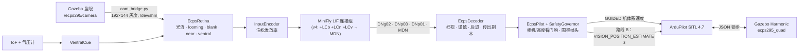

# 报告一：ECPS 295 课程无人机的数字孪生，与 MiniFly v0 → v4 的演进

> 分支 `ecps295-sim` · 代码位于 `ecps295/` · 实验时间 2026-10-01 至 10-04，平台为 ROG Strix G733QR
> （Ryzen 9 5900HX、RTX 3070 Laptop），Gazebo Harmonic 8.15 + ArduPilot Copter-4.7.0 SITL。
> English: [01_twin_and_minifly.en.md](01_twin_and_minifly.en.md)

## 摘要

我们为 295 g / 2S 的课程四旋翼搭了三层数字孪生：FlyDrones 运动学模型 → ArduPilot SITL → 带相机、光流和 ToF 孪生的
Gazebo，并在上面让 FlyDrones 的 *MiniFly* 连接组大脑通过 ArduPilot 完成真正的闭环飞行任务。上游 MiniFly 在 6 项
接近测试中**全部撞墙**。之后的五轮迭代，每一轮都针对孪生里暴露的一个失效：先后加入扫视逃逸、安全看门狗，以及三种新
细胞（LCb 失纹理检测、LCn 居中、LCv 腹侧线索）。v2 已做到 **0/6** 撞墙。S8 消融（报告三）在大样本下确认了这一跃变：
撞墙比例从上游的 100% 降到 v2.1 起的 0%。

## 1. 孪生

| 层 | 内容 | 校验（2026-10-03） |
|---|---|---|
| L1 | FlyDrones `SimDrone`，各轴滞后取自 SITL 辨识 | τ xy / z / yaw = 0.60 / 0.35 / 0.12 s |
| L2 | ArduPilot SITL Copter-4.7.0，课程 `.param`，295 g 机架 JSON | 学到的 `MOT_THST_HOVER` 0.338（目标 0.32） |
| G1 | Gazebo 机体 `ecps295_quad`（LiftDrag 桨叶，电机环 τ 16 ms） | 悬停标准差 2 mm，τ 0.53 / 0.44 / 0.11 s，RTF 1.000 |
| G2 | ELP OV7725 孪生：120° 等距鱼眼，640×480 @ 60 Hz，下俯 12° | 仿真时间 62.7 Hz，桨叶不入画 |
| G3 | 20 ft / 10 ft 课程网笼：网线、EVA 棋盘地垫、纸箱、灯 | 悬停 30 s 于 0.60–0.86 m，计算 p95 9.1 ms |
| S7d | 3901-L0X 孪生：下视 ToF（27°、5×5 束、10 Hz）+ 障碍物上方按测距缩放的 SITL 光流 | 见报告二 |

过程中发现并修复了两处上游缺陷：

- **ArduPilot JSON 后端**判断 `rng_1..6` 时读错了位，Gazebo 的测距从来没有到达测距仪。
  该问题已在 master 修复（ArduPilot#33342），我们提交了 4.7 回移 ArduPilot#34610（见 `sitl/ardupilot_sitl.patch`）。
- **`SIM_FLOW_DELAY` 的单位是采样数，不是毫秒**：课程参数里的 10 实际等于 500 ms 的光流延迟。
  早期"光流速率非常敏感"的结论，大部分其实由此造成。



### 1.1 实时性约束

所有运行都是锁步的，**整段 RTF ≥ 0.95** 的运行才算有效。每多一个观察相机，RTF 就下降 4–6%，所以观察相机只放在
用于观看的 `*_monitor` 世界里。在 ROG 上，控制周期 p95 稳定在 50.1 ms，单次大脑计算约 9 ms（p95），这也是之后为
Orange Pi 回放评估的计算预算。

## 2. 上游大脑在孪生中的表现（G4 测试集）

上游合成 MiniFly，默认配置，前方 1.7 m 处是高墙：

| 测试 | 设置 | 接触 | 刹车起点 | 逃逸起点 |
|---|---|---|---|---|
| T1 v0.15 | 贴胶带墙，0.15 m/s | 是 | 0.23 m | 0.06 m |
| T1 v0.25 | 贴胶带墙，0.25 m/s | 是 | 0.44 m | 0.40 m |
| T1 v0.35 | 贴胶带墙，0.35 m/s | 是 | 1.01 m | 0.50 m |
| T2 | 纯色墙 | 是 | 0.28 m | 无 |
| T3 | 贴胶带墙，右偏 0.45 m | 是 | 0.31 m | 0.15 m |
| T4 | 第 3 s 相机冻结 | 是 | 0.02 m | 无 |
| T5 | 悬停 90 s | 否 | – | – |

**失效机理**：looming 只对"扩张"敏感。飞机刹住后，墙占满视野，画面不再扩张，DNp03 沉默，刹车记忆衰减，巡航指令
就把飞机推进墙里。纯色墙根本不产生光流；整个系统中也没有任何环节发现相机已经冻结。

## 3. MiniFly v1 → v4：一个失效，一个修正

上游代码没有改动。每个变体都是继承上游类，或者用 `my_minifly.py` 增加神经元；上游部分逐位不变，标定 R² 也不变
（油门 0.912，偏航 0.812）。

| 版本 | 改动 | 墙体测试接触 |
|---|---|---|
| v0 | 上游 | 6/6 |
| v1 | 扫视逃逸（转开 + 后退）、谨慎期、传出副本、偏航解耦 | 3/6 |
| v1.1–1.3 | 扫视阈值 15 Hz、刹车触发扫视、1 s 不应期、相机/大脑延迟看门狗 | 胶带墙和偏置墙通过 |
| **v2** | **+ LCb 失纹理细胞**（中央视野突然失去纹理）→ PVLP / DNp01 | **0/6** |
| v2.1 | LCb 左右侧改用整眼无纹理占比 | 转向正确 5/6 |
| v3 | **+ LCn 居中**（侧向前后光流不对称 → 转离近侧） | 转向 3/3，间距 +0.1 m |
| v4 | **+ LCv → MDN**（"月球漫步"神经元）：脚下表面升高时后退 | 见报告二 |

每一步的效果在 S8 消融中按大样本重新测量：


*图 1. 墙体接近（E2，每级 n = 32）与矮箱子巡航（E1，n = 20/50），无 GPS。v2.1 引入 LCb 后撞墙比例降为 0%，
最小间距从 −0.10 m 升到约 0.65 m。*

### 3.1 网笼里剩下的失效

在 20 ft 网笼的 120 s 巡航中，v3 系列的所有接触都是箱垛（1.1 m，紧贴围栏）一角上 ≤ 4 cm 的擦碰。围栏掉头让飞机绕
菱形航线飞行，每圈都斜着经过这个角；障碍物产生的是侧向光流而不是扩张，DNp03 直到约 5 cm 才有反应。这个失效后来
成为报告四中 CMA-ES 的优化目标。

| 变体（20 ft 网笼，5 个种子，GPS） | 有接触的运行 | 险情 |
|---|---|---|
| v2.1 | 3 | 8 |
| v3（围栏优先于扫视） | 0 | 5 |
| v3.1 | 3 | 9 |
| v3.2（居中视野改用外侧 5 列） | 2 | 12 |

## 4. 局限

- Gazebo 推力是转速的二次函数，最大转速沿用 Iris 的数值；JSON 接口下没有电池电流模型。
- looming 依赖纹理。纸箱和 EVA 地垫的纹理只是近似，真实网笼的照度测量还没有做。
- §3.1 中 5 个种子的巡航统计无法区分各变体。这也是之后改用 20–50 个世界加配对检验的原因。

## 5. 复现

```bash
cd ~/sim/FlyDrones/ecps295
VARIANT=v2 DECODER=ecps PILOT=ecps RETINA=ecps bash scripts/g4_suite.sh        # 墙体测试集
bash ~/sim/gz_g4.sh ecps295_cage20.sdf patrol "--config minifly/v3.yaml --decoder ecps --pilot ecps \
     --retina ecps --mode patrol --seconds 120 --fence-turn --out patrol"   # 120 s 网笼巡航
```
