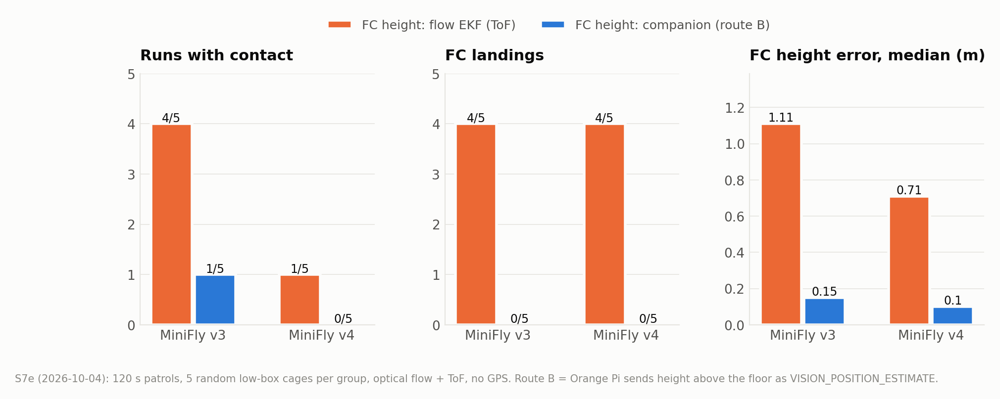
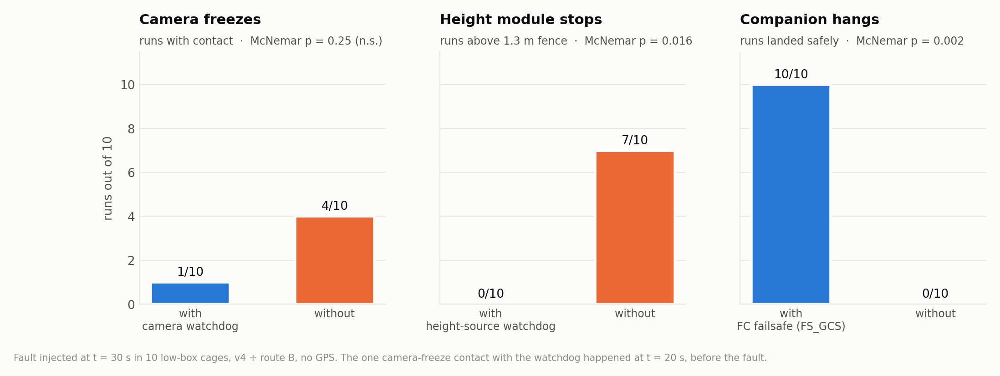

# 报告二：无 GPS 飞行：光流、矮箱子问题与路线 B

> 分支 `ecps295-sim` · 实验 S7d / S7e / S7b，2026-10-03 至 10-05 · ROG，Gazebo 8.15 + SITL 4.7（打补丁）
> English: [02_gps_free_navigation.en.md](02_gps_free_navigation.en.md)

## 摘要

真机没有 GPS，靠 Matek 3901-L0X（PMW3901 光流 + VL53L0X ToF，均朝下）导航。在孪生中，飞越 0.46–0.6 m 高的箱子时，
**飞控的高度估计被拉低 0.4–1.0 m**：飞控随之爬升，冲过 1.3 m 硬围栏后自行降落。调 EKF 的地形参数也没有用。我们从两头
解决：**路线 B**，由机载计算机把"离地板高度"作为外部导航高度发给 ArduPilot；**MiniFly v4**，增加一条腹侧通路
（LCv → MDN），脚下表面升高时后退。路线 B 消除了全部飞控降落，高度误差保持在 0.10–0.15 m；v4 + 路线 B 在 5 个随机
矮箱子网笼中零接触。故障注入（S7b）随后暴露了三种没有防护的失效，每种都补上了专门的安全机制。

## 1. 设置

- `NAV=flow`：EKF3 使用光流 + ToF（`sitl/fhb_delta.parm`）；固定磁偏角（`COMPASS_AUTODEC 0`），否则没有 GPS 时
  EKF 的航向会偏 11°。
- 无 GPS 起飞：设置 EKF 原点；ALT_HOLD 下用 sysid 255 的 RC 覆盖起飞；0.1 m 时切 GUIDED；爬升直到 ToF 或 EKF 达到
  目标高度（EKF 高度最多比 ToF 滞后 0.8 m）。
- 所有评分使用仿真真值（`SIM_STATE`），EKF 估计值另列记录。
- 5 个随机矮箱子网笼 `ecps295_lowbox_s0..4`：每个 6 个箱子，高 0.2–0.75 m 或为 1.1 m 箱垛，距起点 1.0–2.3 m。

## 2. S7d：哪里出了问题

v3，120 s 巡航，20 ft 网笼，5 个种子：

| 配置 | 有接触的运行 | 航程 m | EKF 水平误差最大值（中位 / 最大） | 超过 1.3 m 的运行 | 落地的运行 |
|---|---|---|---|---|---|
| GPS | 1 | 25.2 | 0.05 / 0.05 | 0 | 0 |
| 光流，ToF 为主高度 | 1 | 12.6 | 0.42 / 0.77 | 4 | 4 |
| 光流，仅气压计 | 0 | 18.7 | 0.67 / 4.80 | 2 | 2 |
| 光流，气压计 + EKF 地形参数 | 3 | 18.7 | 0.61 / 1.56 | 2 | 1 |

**机理**：箱子经过飞机下方时，ToF 读数下降（0.83 → 0.40 m）。ToF 作为主高度时，它直接把 EKF 拉低；只用气压计时，
箱子仍然会通过光流融合的地形状态影响高度，尽管气压计高度本身是对的。于是控制器用爬升来"修正"。

## 3. S7e：两处修正

**腹侧线索**：地表高度 *T = 气压计高度 − ToF 读数*。飞机自身的升降会让两项同步变化，所以只有脚下表面变化时 *T* 才
会变化；另设快速通道，捕捉 ≥ 0.10 m、快于 0.6 m/s 的台阶。在 S7d 的日志上离线评估：检测到 90% 的箱子穿越，延迟
中位数 0.2 s。

**MiniFly v4**：v3 + 每侧 16 个 LCv 细胞 → 每侧 2 个 MDN（"月球漫步"下行神经元，在果蝇中驱动后退行走）。解码器的
`retreat` 让飞机沿来路后退，直到 MDN 安静 1 s，再做一次扫视。早期版本仿照 LCb 把 LCv 接到 PVLP，结果飞机在箱子上方
原地扫视了 5 s。

**路线 B（机载高度）**：机载计算机以 20 Hz 发送 `VISION_POSITION_ESTIMATE` z = 离地板高度。下方没有物体时用倾角
校正后的 ToF；下方有物体时用气压计减去冻结的地板基线。飞控侧设置 `EK3_SRC1_POSZ 6`、`VISO_TYPE 1`。这样 EKF 的
地形状态会把箱子当作地形，这本来就是对的。

*图 2. S7e，每组 5 个随机矮箱子网笼，无 GPS。路线 B 把飞控降落从 4/5 降到 0/5，高度误差中位数从约 1 m 降到 0.1 m；
v4 提供第二层防护：接触更少，停在箱子上方的时间缩短到三分之一。*

| 大脑 | 飞控高度 | 接触 | 险情 | 航程 m | 箱子上方 s | 最高真实高度 m | 飞控降落 |
|---|---|---|---|---|---|---|---|
| v3 | 光流 EKF | 5 | 7 | 7.9 | 9.2 | 1.47 | 4 |
| v4 | 光流 EKF | 1 | 1 | 7.8 | 3.9 | 1.45 | 4 |
| v3 | 路线 B | 1 | 2 | 26.4 | 24.2 | 1.02 | 0 |
| v4 | 路线 B | **0** | 4 | 23.6 | 8.3 | 1.00 | **0** |

一个看起来更省事的办法失败了：在 EcpsPilot 里加 `height_guard`，高于 1.0 m 就下发下降指令。ArduPilot 是在它自己
被污染的高度坐标系里执行速度指令的，所以这个保护挡不住爬升。

## 4. S7b：机载计算机故障

路线 B 让机载计算机进入了高度回路，它的故障就必须处理。第一轮实验（第 30 s 注入故障）的结果：

- **高度消息中断后恢复**：ArduPilot 退回气压计，恢复后 2 cm 内切回外部导航，没有问题。
- **高度消息永久中断，大脑继续飞**：4/5 次飞控降落，最高 2.17 m。依靠气压计时，一个箱子在 2 s 内把 EKF 高度
  从 0.87 m 拉到 −0.04 m。
- **机载计算机卡死**：GUIDED 超时，飞机靠气压计悬停，直到电池耗尽。
- **v4 的后退沿箱子边缘持续了 4 s，倒着撞上障碍物**：没有任何传感器朝后看。

对应修正：EcpsPilot 高度源看门狗（0.5 s 悬停，3 s 降落）；`retreat.max_s = 2.0`；`companion_fs.parm`（机载
计算机的 sysid 254 视为地面站，心跳停止 2 s 后由 `FS_GCS_ENABLE 5` 降落）。每项都在 10 个网笼中做了有/无对照
（即 S8 的 E3）：

*图 3. 第 30 s 注入故障，每组 10 个矮箱子网笼，精确 McNemar 配对检验。*

## 5. 结论

1. 使用光流 + ToF 时，飞机下方的矮障碍会污染飞控高度。这不能靠调 EKF 解决，必须给飞控一个"离地板"的高度。
2. 路线 B 是无 GPS 飞行能否成立的前提：S8 中去掉它，任务成功率从 82% 降到 10%（报告三）。
3. 机载计算机由此成为安全关键部件。两个看门狗加飞控失联保护，让测试的每一种机载故障都以悬停或降落结束。
4. 在路线 B 正常工作时，v4 腹侧通路的主要作用是缩短停在箱子上方的时间；它的价值在于高度估计失效时的行为层冗余。

## 6. 局限

SITL 气压计只有 ±0.2 m 的均匀噪声，没有桨洗和温漂，所以路线 B 中"气压计 − 地板基线"的分支在真机上会更差。
3901-L0X 的输出率和延迟、VL53L0X 的边缘读数混合方式都需要台架实测；Orange Pi 上的外部导航延迟也尚未测量。
