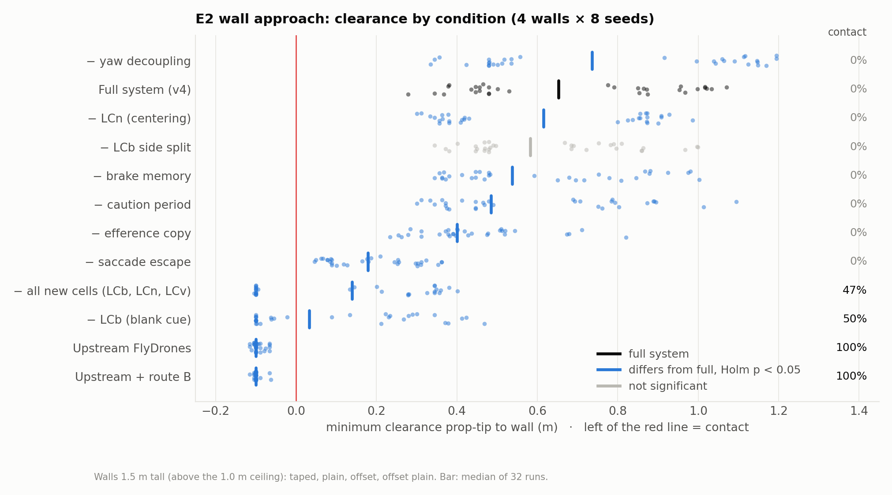

# 报告三：S8 消融实验：在最终硬件孪生上的 1,260 次闭环飞行

> 分支 `ecps295-sim` · 2026-10-05/06 · ROG Strix G733QR，Gazebo Harmonic 8.15 + ArduPilot Copter-4.7.0 SITL
> 本文是带图的摘要版；方法细节和全部表格见完整报告 [`REPORT_zh.md`](../results/ablation_2026-10-06/REPORT_zh.md)，
> 原始数据与配对统计见 [`results/ablation_2026-10-06/`](../results/ablation_2026-10-06/)。
> English (full): [03_s8_ablation.en.md](03_s8_ablation.en.md)

## 摘要

我们在最终硬件的数字孪生上（光流 + ToF，**无 GPS**，路线 B），逐一去掉 MiniFly 的每项定制改动和每项系统修正。
共 **1,260 次闭环飞行**，全部满足整段 RTF ≥ 0.95，没有排除任何运行。比较按回合配对（同一世界、同一大脑种子），
每个指标内做 Holm 校正。

| 结论 | 证据 |
|---|---|
| **墙体避障靠 LCb（失纹理检测）** | 去掉后撞墙 0% → 50%，最小间距 0.68 → 0.10 m（p < 0.001） |
| **扫视逃逸决定安全裕度** | 去掉后每 100 m 撞击 1.07 → 10.5（p = 0.002），墙前间距仅 0.19 m |
| **路线 B 是无 GPS 飞行的前提** | 去掉后 88% 飞控降落，成功率 82% → 10%（p < 0.001） |
| **传出副本本质上是高度稳定组件** | 去掉后低飞 0.17 m，矮箱子变成同高度障碍（6.25 次/100 m，p = 0.017） |
| **v4 腹侧通路是冗余，不是正常工况下的安全收益** | 箱子上方时间 21.8 → 9.4 s（p < 0.001），撞击无差异 |
| **三项安全机制在故障下全部有效** | 高度看门狗 7/10 → 0/10 冲出围栏（p = 0.016），飞控失联保护 0/10 → 10/10 降落（p = 0.002） |

## 1. 实验设计（概要）

| 实验 | 场景 | 回合 | 条件 | 运行次数 |
|---|---|---|---|---|
| E1 巡航 | 20 ft 网笼内的随机矮箱子世界，120 s | 关键 9 个条件 50 个世界，其余 20 个 | 22 | 710 |
| E2 墙体接近 | 1.5 m 高墙：胶带 / 纯色 / 偏置 / 偏置纯色，20 s | 4 种墙 × 8 个种子 = 32 | 15 | 480 |
| E3 故障注入 | E1 的 10 个世界，第 30 s 注入 | 10 | 7 | 70 |

主要安全指标是**每 100 m 撞击数**。只看撞击率会误导：上游原版到围栏边就停住，平均只飞 2.9 m。连续指标用 Wilcoxon
符号秩检验，二值指标用精确 McNemar，均值和配对差给出 10,000 次 bootstrap 的 95% CI。

## 2. 结果

*图 1. E1：各条件与完整系统的配对差（完整系统：每 100 m 撞击 1.07 [0.44, 1.87]，成功率 82% [70, 92]）。
蓝色表示 Holm 校正后 p < 0.05。*

*图 2. E2：每次接近的最小间距（每个条件 32 次）。只有去掉 LCb 的条件和上游大脑撞过墙；谨慎期、刹车记忆、LCn 这类
细粒度组件各自贡献 6–8 cm 的余量。*

*图 3. 逐级叠加：v2.1 引入 LCb 时撞墙比例从 50% 降到 0%。*

E3 故障注入的结果见[报告二](02_gps_free_navigation.zh.md)图 3。

## 3. 讨论要点

- **纯色墙对 looming 不可见**：上游 looming 依赖光流，无纹理的墙几乎不产生光流。没有 LCb 时，逃逸起点从 0.89 m
  推迟到 0.20 m。
- **转身，而不是爬升**：在 1.0 m 软天花板下，上游的爬升逃逸没有空间。改为扫视（转开 + 后退）后，巡航撞击降低约
  10 倍。
- **传出副本其实是高度组件**：它抵消前飞时地面光流造成的"在上升"错觉。去掉后，大脑持续压低飞机，直到矮箱子与
  飞机同高。
- **v4 应表述为兜底层**：路线 B 正常时，飞越箱子本身无害，腹侧通路只改变停在箱子上方的时间；它的价值体现在高度
  估计失效时（S7d）。
- **与 GPS 持平**：同一个 v4 大脑用 GPS 导航时，撞击和成功率与无 GPS 方案没有显著差异。

## 4. 局限

1. 仿真与真实的差距：SITL 气压计没有桨洗和漂移；3901-L0X、VL53L0X 尚未做台架标定。
2. 场景单一：只有 20 ft 网笼里的纸箱。
3. n = 20 的条件统计功效不足，"不显著"不等于"没有作用"。例如去掉谨慎期后每 100 m 撞击 4.12 对 1.07，但 Holm
   校正后 p = 1。
4. **S8 的全部运行都早于 SafetyGovernor slew 符号修复（`8b8eef9`）**：修复前，负向指令松开后要 150 ms 才回零，
   而不是立即回零。在 cage20 上，这一修复使 v3_2 有接触的运行从 10/32 变为 8/32（见报告四）。关键条件的修复后复测已在计划中。
