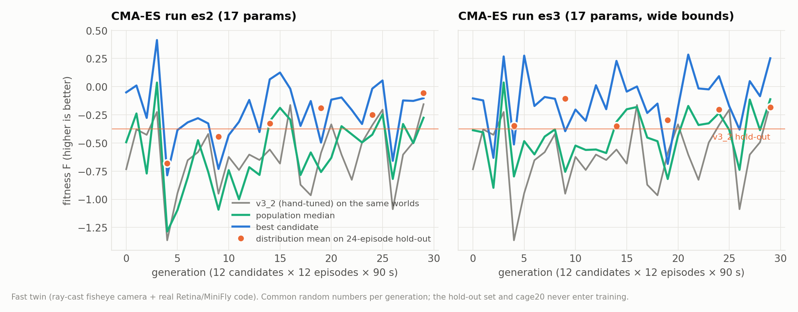
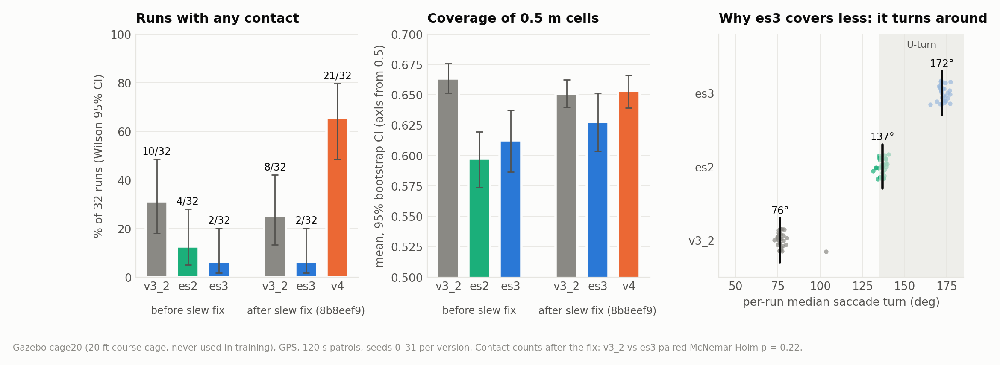
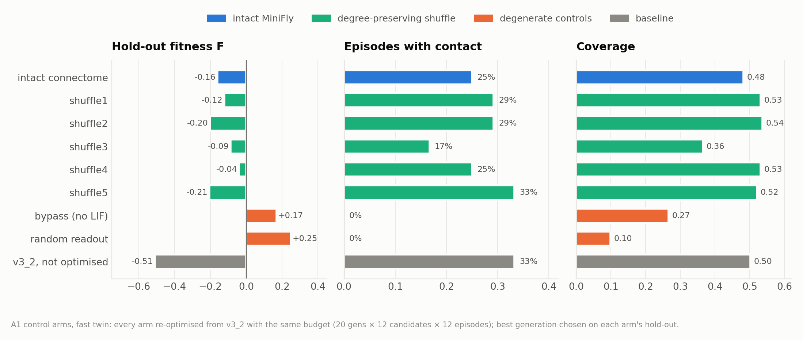

# ECPS 295 experiment reports · 实验报告

Bilingual reports for the `ecps295-sim` branch: a connectome-driven 295 g quadrotor flown through ArduPilot in a
Gazebo digital twin, without GPS. Every figure is generated by [`make_figures.py`](make_figures.py) from result files
committed in this branch.

`ecps295-sim` 分支的中英双语实验报告：在 Gazebo 数字孪生中，由果蝇连接组驱动的 295 g 四旋翼通过 ArduPilot 无 GPS 飞行。
所有图表都由 [`make_figures.py`](make_figures.py) 从本分支已提交的结果文件生成。

| # | Topic · 主题 | English | 中文 | Key result · 关键结果 |
|---|---|---|---|---|
| 1 | Digital twin, MiniFly v0 → v4 · 数字孪生与 MiniFly 演进 | [EN](01_twin_and_minifly.en.md) | [中文](01_twin_and_minifly.zh.md) | wall suite 6/6 → 0/6 contacts · 墙体测试撞墙 6/6 → 0/6 |
| 2 | GPS-free navigation, route B, companion faults · 无 GPS 导航、路线 B、机载故障 | [EN](02_gps_free_navigation.en.md) | [中文](02_gps_free_navigation.zh.md) | FC landings 4/5 → 0/5, height error ~1 m → 0.1 m · 飞控降落 4/5 → 0/5 |
| 3 | S8 ablation, 1,260 flights · S8 消融，1,260 次飞行 | [EN](03_s8_ablation.en.md) | [中文](03_s8_ablation.zh.md) · [完整版](../results/ablation_2026-10-06/REPORT_zh.md) | LCb, saccade, route B, efference copy are load-bearing · 关键组件得到确认 |
| 4 | CMA-ES decoder optimisation and control arms · CMA-ES 优化与对照臂 | [EN](04_cmaes_optimisation.en.md) | [中文](04_cmaes_optimisation.zh.md) | 8/32 → 2/32 contact runs, n.s. after the slew fix · slew 修复后不显著 |

## Figures · 图表

| | |
|---|---|
|  **Fig 1** Version ladder · 版本阶梯 |  **Fig 2** E1 ablation forest plot · 消融森林图 |
|  **Fig 3** E2 wall clearance · 墙前间距 |  **Fig 4** E3 fault injection · 故障注入 |
|  **Fig 5** Route B vs flow EKF · 路线 B 对比 |  **Fig 6** CMA-ES convergence · 收敛曲线 |
|  **Fig 7** Gazebo cage20 hold-out · 留出网笼测试 |  **Fig 8** A1 control arms · 对照臂 |

```bash
cd ecps295 && python reports/make_figures.py    # numpy + matplotlib; rewrites reports/figures/*.png
```

**Conventions · 约定.** Every Gazebo run counts only if its whole-run real-time factor is ≥ 0.95 (server runs use a
sim-time clock instead). Paired comparisons use the same world and brain seed; p-values are Holm-corrected per metric.
Positions are simulator truth, not the EKF estimate. S8 (Report 3) was run before the SafetyGovernor slew fix
`8b8eef9`.
Gazebo 运行仅在整段 RTF ≥ 0.95 时有效（服务器上改用仿真时钟）；配对比较使用相同世界和大脑种子，p 值按指标做 Holm 校正；
位置一律取仿真真值而非 EKF 估计；S8（报告三）早于 SafetyGovernor slew 修复 `8b8eef9`。
